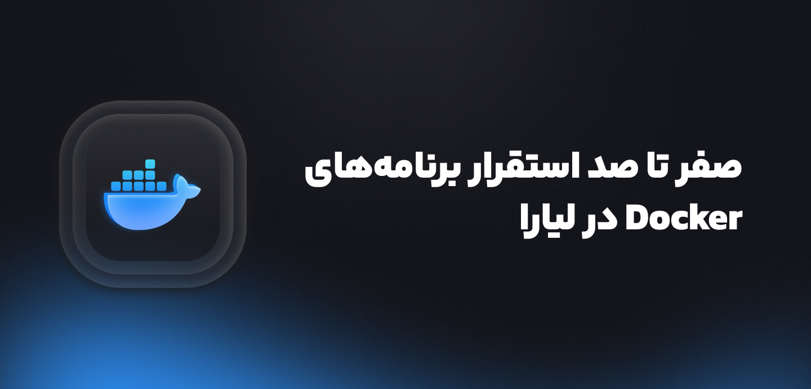

{/* source: saeed0920/liara-docs#3 */}
## Clearer setup commands in README

README setup commands now include Bash syntax highlighting, making installation steps easier to scan and copy.

### Improved

- Added Bash language labels to setup command blocks.
- Improved readability of clone, install, and development instructions.

### Fixed

- Command blocks no longer render without syntax highlighting.

---

## Human-reviewed changelog publishing

Merged `liara-docs` pull requests can now send their changelog-ready descriptions here automatically when they carry the `changelog` label.

### Added

- PR-template sections keep public release notes separate from internal implementation details.
- Embedded PR images are downloaded and re-hosted with the changelog.
- Every generated update opens a reviewable `docs-blogs` pull request—nothing auto-merges.

### Improved

- Empty entries, duplicate workflow runs, and unsafe MDX braces are handled before a changelog PR opens.
- Changelog pull requests run a production build before human review and deployment.

---

## A clearer place to follow updates

This first changelog release adds a dedicated home for meaningful changes. It keeps updates short, scannable, and close to the documentation they affect.

### Added

- New `/changelog` route with a responsive, accessible layout.
- Custom release artwork matching the site's warm neutral and green theme.
- Changelog links in the main navigation and home page.

### Improved

- Release notes now explain both **what changed** and why it helps.
- Layout supports light mode, dark mode, mobile screens, and reduced motion.

> Future releases will be added here as small Markdown entries—no extra page code needed.
